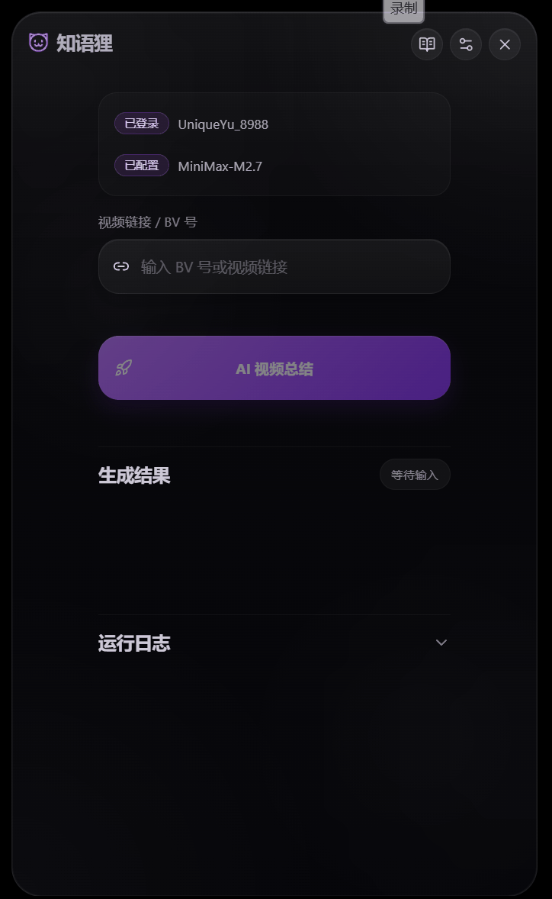
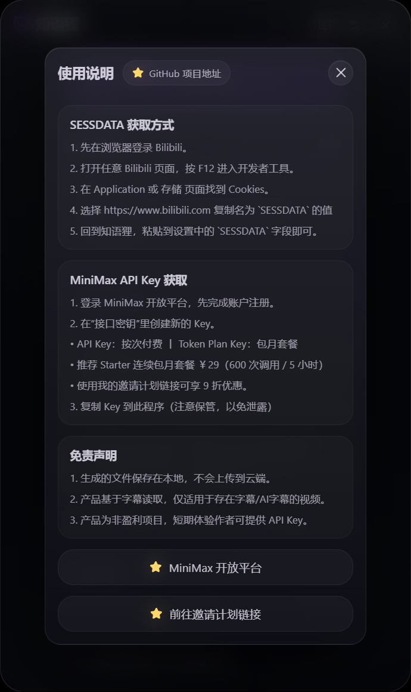
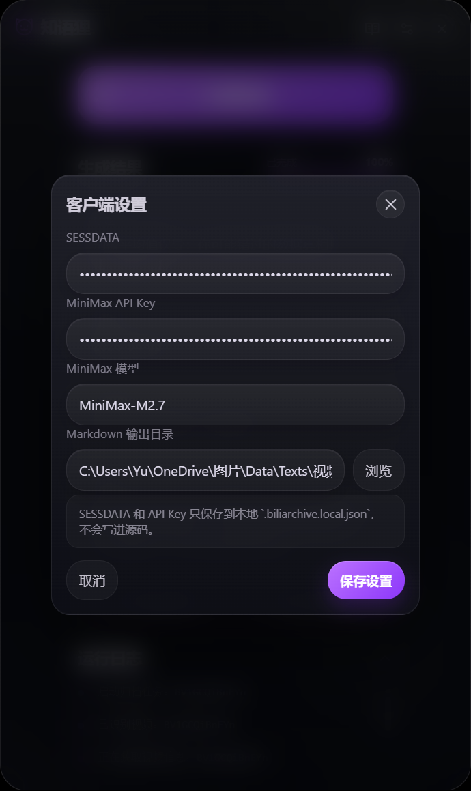

# ZhiYuFox / 知语狸

知语狸是一个面向 Windows 的 Bilibili 视频总结工具。

你只需要粘贴一个 BV 号或视频链接，程序就会尽量读取视频字幕，并生成一份适合阅读、收藏和整理的 Markdown 笔记。

它更适合这样的场景：

- 看完一个长视频后，想快速留下重点
- 想把 B 站教程、知识视频整理成笔记
- 想把内容保存到 Obsidian、Notion 或自己的知识库里

## 界面预览

<p align="center">
  
</p>

<p align="center">
  
  
</p>

## 它能做什么

- 输入 BV 号或视频链接，一键生成 AI 视频总结
- 输出统一格式的 Markdown 文件，便于保存和整理
- 自动尽量过滤广告、植入和带货内容
- 对多分 P 视频，会尽量合并全部可获取字幕的分 P
- 如果有些分 P 没有字幕，会在结果里明确标出来

## 生成出来的内容长什么样

默认会生成一份 Markdown，包含：

- 视频标题
- 发布日期
- `视频主题`
- `主要内容`
- 适合整理的 `tags`

如果是多分 P 视频，程序会尽量在同一个文档里保留分 P 结构，而不是全部混成一段。

## 使用方法

### 1. 准备登录信息

程序依赖 Bilibili 的字幕接口，所以建议先在设置里填好 `SESSDATA`。

获取方式：

1. 在浏览器登录 Bilibili
2. 打开任意 Bilibili 页面，按 `F12`
3. 在 `Application` 或 `存储` 页面找到 `Cookies`
4. 选择 `https://www.bilibili.com`
5. 复制名为 `SESSDATA` 的值，粘贴到知语狸设置里

### 2. 准备 MiniMax API Key

程序的 AI 总结依赖 MiniMax。

你可以在软件内的“使用说明”里直接跳转到：

- MiniMax 开放平台
- 邀请计划链接

拿到 Key 后，填到设置里的 `MiniMax API Key` 即可。

### 3. 开始使用

1. 打开知语狸
2. 输入 BV 号或视频链接
3. 点击 `AI 视频总结`
4. 等待生成完成
5. 打开生成的 Markdown 文件

## 适用范围

知语狸不是“任何视频都能完整总结”。

它目前的工作方式是：**基于字幕读取来做总结**。  
所以它更适合：

- 本身有字幕的视频
- 有 AI 自动字幕的视频
- 教程、知识、访谈、资讯这类字幕信息比较完整的视频

## 你需要知道的限制

- 如果视频没有字幕，程序通常无法生成有效总结
- 如果多分 P 视频里只有部分分 P 有字幕，程序只能总结有字幕的那部分
- AI 总结会尽量保留重点，但不能保证完全替代手动看视频
- 目前不提供视频下载，也不输出 JSON

## 隐私与本地数据

程序生成的文件保存在本地，不会自动上传到云端。

这些敏感信息只会保存在你的本地配置文件中，不会写入仓库：

- `SESSDATA`
- MiniMax API Key
- 本地窗口状态
- 运行日志

## 发布产物

桌面版发布文件默认位于：

```text
desktop/release/
```

## 开发相关

如果你希望自己在本地运行或二次开发：

### Python 依赖

```bash
pip install -r requirements.txt
```

### 桌面端开发

```bash
cd desktop
npm install
npm run build:web
```

### 生成桌面发布版

```bash
cd desktop
npm run build:mirror
```

## 致谢

本项目在功能思路和底层实现上，参考并基于 ProfessorZhi 的项目继续定制开发：

- [ProfessorZhi/BiliArchive](https://github.com/ProfessorZhi/BiliArchive)

感谢朋友 Zhi 提供底层代码基础，让这个项目能够继续发展成现在的形态。
