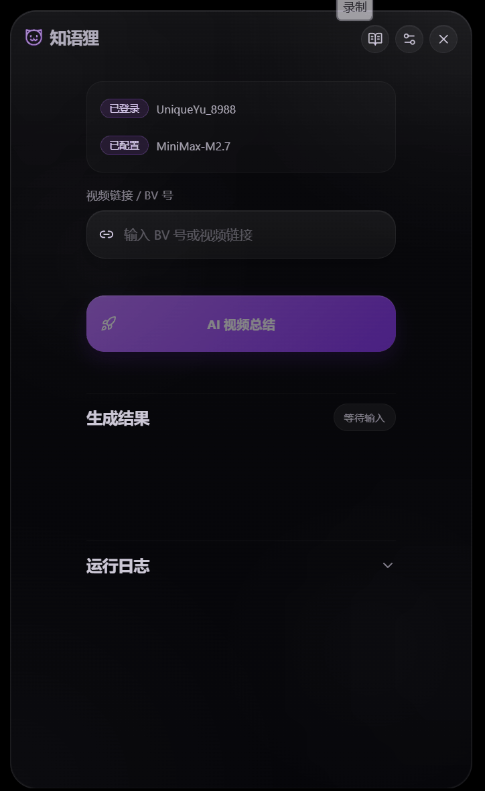
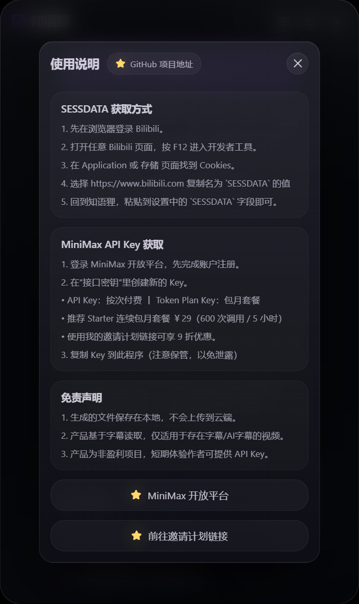
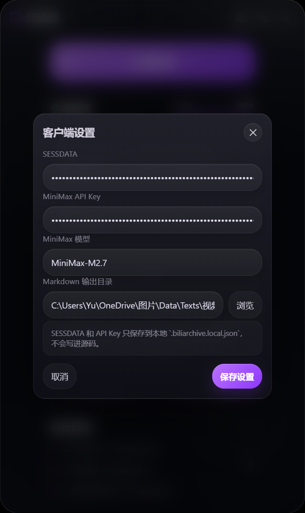

# ZhiYuFox / 知语狸

知语狸是一个面向 Windows 的 Bilibili 视频总结工具。

你只需要粘贴一个 `BV` 号或视频链接，程序就会自动判断该走哪条路线：

- 有字幕：直接读取字幕并生成总结
- 没字幕：自动切换到音频方案，提取音频后调用 `Groq Whisper` 转写，再继续生成总结

现在的知语狸，已经不再只是“字幕视频整理器”，而是一个更完整的 **Bilibili 视频内容总结工具**。

它适合这样的场景：

- 看完长视频后，想快速留下重点
- 想把教程、知识、新闻、访谈整理成笔记
- 想把 B 站内容沉淀到 Obsidian、Notion 或自己的知识库

## 界面预览

<p align="center">
  
</p>

<p align="center">
  
  
</p>

## 2.0 版本能力

- 输入 `BV` 号或视频链接，一键生成 AI 视频总结
- 优先读取 Bilibili 字幕，保留原有高质量总结路径
- 无字幕时自动切换到音频方案，调用 `Groq Whisper` 做转写
- 支持多分 `P` 视频，尽量合并全部可获取文本
- 会明确标出哪些分 `P` 没有参与总结
- 自动尽量过滤广告、植入和带货内容
- 输出统一格式的 Markdown，方便保存、归档和二次整理

## 生成结果长什么样

默认会生成一份 Markdown，包含：

- `title`
- `date`
- `tags`
- `### 💡 视频主题`
- `### ✨ 主要内容`

如果是多分 `P` 视频，程序会尽量在同一个文档里保留分 `P` 结构，而不是全部混成一段。

## 工作方式

知语狸现在有两条处理路径：

### 方案 1：字幕方案

优先读取视频已有字幕或 AI 字幕，再交给模型总结。

这一条通常速度更快、成本更低，也更稳定。

### 方案 2：音频方案

如果视频没有可用字幕，程序会自动：

1. 提取音频
2. 压缩处理
3. 调用 `Groq Whisper` 转写
4. 将转写结果继续交给 AI 生成总结

这意味着现在很多原本“无法处理”的视频，也能继续生成结果。

## 使用方法

### 1. 准备 Bilibili 登录信息

程序优先依赖 Bilibili 的字幕接口，所以建议先在设置里填好 `SESSDATA`。

获取方式：

1. 在浏览器登录 Bilibili
2. 打开任意 Bilibili 页面，按 `F12`
3. 在 `Application` 或 `存储` 页面找到 `Cookies`
4. 选择 `https://www.bilibili.com`
5. 复制名为 `SESSDATA` 的值，粘贴到知语狸设置里

### 2. 准备 MiniMax API Key

程序的总结生成依赖 `MiniMax`。

拿到 Key 后，填到设置里的 `MiniMax API Key` 即可。

### 3. 准备 Groq API Key

当视频没有字幕，或者部分分 `P` 缺字幕时，程序会自动尝试音频方案。

所以如果你希望知语狸尽可能覆盖更多视频，建议也在设置里填好 `Groq API Key`。

### 4. 开始使用

1. 打开知语狸
2. 输入 `BV` 号或视频链接
3. 点击 `AI 视频总结`
4. 等待处理完成
5. 打开生成的 Markdown 文件

## 适用范围

知语狸现在已经可以处理：

- 有字幕的视频
- 有 AI 字幕的视频
- 没字幕但可通过音频转写补救的视频
- 多分 `P` 视频

它尤其适合：

- 教程
- 知识分享
- 新闻资讯
- 访谈播客
- 评论解读

## 你需要知道的限制

虽然现在能力大幅增强，但它仍然不是“任何视频都能 100% 完美总结”。

你需要知道这些边界：

- 如果视频音质很差、背景音乐太强或人声混杂，音频转写效果会下降
- 如果多分 `P` 视频里只有部分分 `P` 能拿到字幕或转写文本，程序只会总结已获取文本的部分
- AI 总结会尽量保留重点，但不能完全替代人工观看
- 目前不提供视频下载，也不输出 JSON

## 隐私与本地数据

程序生成的文件保存在本地，不会自动上传到云端。

这些敏感信息只会保存在你的本地配置文件中，不会上传到仓库：

- `SESSDATA`
- `MiniMax API Key`
- `Groq API Key`
- 本地窗口状态
- 运行日志

## 发布产物

桌面版发布文件默认位于：

```text
desktop/release/
```

## 开发相关

如果你希望自己在本地运行或二次开发：

### Python 依赖

```bash
pip install -r requirements.txt
```

### 桌面端开发

```bash
cd desktop
npm install
npm run build:web
```

### 生成桌面发布版

```bash
cd desktop
npm run build:mirror
```

## 致谢

本项目在功能思路和底层实现上，参考并基于 ProfessorZhi 的项目继续定制开发：

- [ProfessorZhi/BiliArchive](https://github.com/ProfessorZhi/BiliArchive)

感谢朋友 Zhi 提供底层代码基础，让这个项目能够继续发展成现在的形态。
